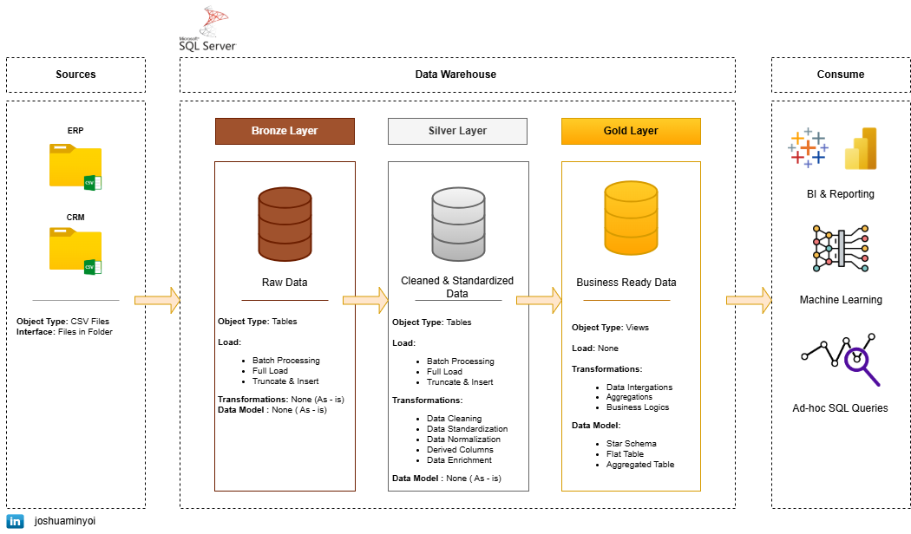

# Data Warehouse and Analytics Project

---

Welcome to the **Data Warehouse and Analytics Project** repository!  This project demonstrates a comprehensive data warehousing solution built on SQL Server using medallion architecture principles. The implementation features end-to-end ETL processes, robust data modelling, and advanced analytics capabilities. Designed as a portfolio project, it showcases modern data engineering best practices and delivers actionable business insights.

---

## 🎯 Project Objectives

---

**Data Engineering**

Develop a modern data warehouse using SQL Server to consolidate sales data, enabling analytical reporting and informed decision-making.

**Data Analytics**

Develop SQL-based analytics to deliver detailed insights into customer behaviour, product performance and sales trends.

---  

## 🧩 Data Architecture

---

The architecture follows the **Medallion model**, which organises data in layered stages for scalable analytics and data quality management.

- **Bronze Layer – Raw Data Ingestion**  
  Stores raw data exactly as received from source systems (ERP, CRM). Data is ingested from **CSV files** into **SQL Server staging tables** with no transformations, preserving the original format.

- **Silver Layer – Cleansed and Structured Data**  
  Transforms raw data through **cleansing, normalisation, and standardisation**. 

- **Gold Layer – Business-Ready Data Models**  
  Contains **refined and aggregated data** modelled in a **Star Schema** format. Designed for **BI dashboards, ad-hoc queries, and machine learning**, it includes calculated KPIs and logic aligned with business needs.

